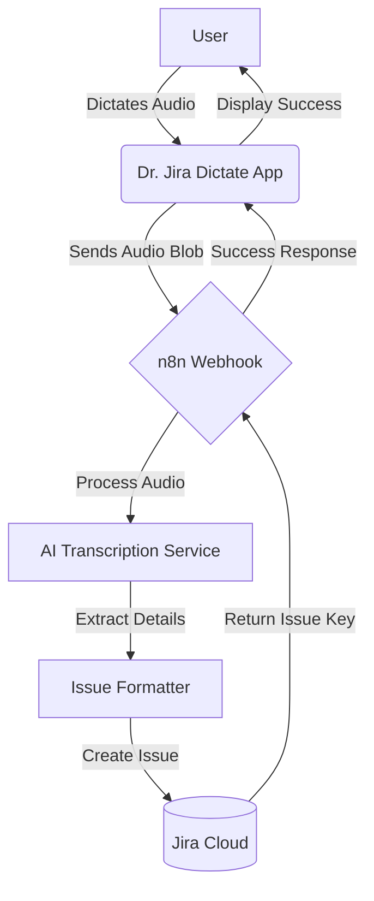

# Dr. Jira Dictate

## Overview

**Dr. Jira Dictate** is an AI-powered Atlassian Forge app that revolutionizes how you create Jira issues. Instead of typing out lengthy descriptions, you simply speak. The app records your voice, processes it using advanced AI, and automatically populates structured Jira issues with a Summary and Description.

This tool is especially useful for mobile users, field technicians, or anyone who prefers dictation over typing, ensuring that no detail is lost in translation.

## How It Works

1.  **Record**: Open the Dr. Jira Dictate app in Jira and record your issue details verbally.
2.  **Process**: The audio is securely transmitted to an n8n workflow.
3.  **Transcribe & Analyze**: The workflow uses AI (like OpenAI Whisper) to transcribe the audio and structure the information.
4.  **Create**: A new Jira issue is automatically created with the transcribed details.
5.  **Feedback**: The app updates to confirming the issue creation.

## System Flow

## Setup & Deployment

1.  **Install Dependencies**: `npm install`
2.  **Deploy**: `forge deploy`
3.  **Install**: `forge install`
